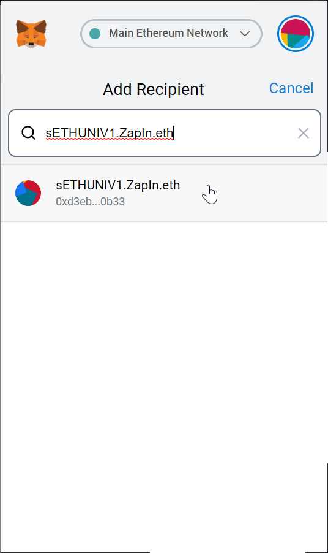
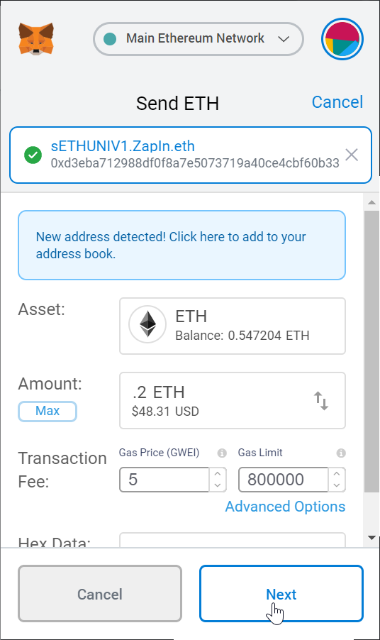
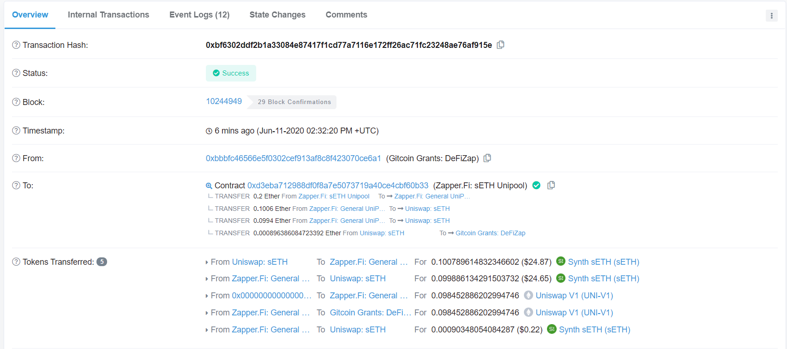

# 🔌ENS Connectors

We've registered some popular pools with the [Ethereum Name Service](https://ens.domains/) so that adding liquidity is as easy as sending a text. Simply send your ETH to a human-readable address and you will become a liquidity provider for that pool. No UI required.

### **Available Connectors**

| ENS | Action | Gas requirement | Strategy |
| :--- | :--- | :--- | :--- |
| [sETHUNIV1.ZapIN.eth](https://etherscan.io/address/0xd3eba712988df0f8a7e5073719a40ce4cbf60b33) | Add liquidity to ETH/sETH pool on Uniswap V1 | 800,000 | Keep ETH exposure while generating SNX rewards. |
| [DAIUNIV1.ZapIN.eth](https://etherscan.io/address/daiuniv1.zapin.eth) | Add liquidity to ETH/DAI pool on Uniswap V1 | 400,000 | Expect ETH price to remain relatively the same for the duration of your liquidity provisioning. |
| [MKRUNIV1.ZapIN.eth](https://etherscan.io/address/mkruniv1.zapin.eth) | Add liquidity to ETH/MKR pool on Uniswap V1 | 400,000 | MKR/ETH ratio will remain the same. Meaning both MKR & ETH will increase/decrease at around the same rate in USD terms.  |


**NOTE: YOU CAN EXECUTE THESE ACTIONS WITH ETH DEPOSITS ONLY. DO NOT SEND ERC20 TOKENS.**


### How does it work

**Step 1:** Open your wallet, click send and enter in your desired ENS connector name. If your wallet does not support ENS, you can paste contract addresses directly.

**Step 2:** Choose how much ETH you would like to deposit, set your gas limit, and confirm the transaction.

**Once processed you will receive your minted UNI-V1 LPs back to your wallet. This is the same thing as adding liquidity via UI but in this case no UI necessary! Add liquidity as easy as sending a text** ⚡️

