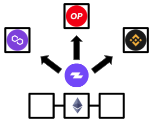
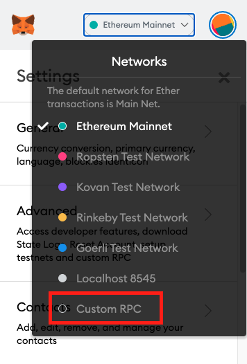

# Bridge



## What is the Purpose of a Bridge?

A bridge is an easy way of porting assets from Ethereum to layer 2s and sidechains. By being able to port their assets over, you gain access to lower fees when interacting with different defi protocols. Zapper currently only supports a one way bridge, but there are plans to make it a two way bridge in the near future.

**Currently Supporting:**

* **Polygon**
* **Binance Smart Chain**
* **Optimism** - Coming Soon
* **xdai** - Coming Soon

### Connecting to a Network - Polygon \(Matic\)

You will need to first set up a custom RPC to connect your wallet to the Matic Mainnet. Then click on the network options in Metamask on the top and select Custom RPC in the dropdown.

Then enter in the information below to create a custom RPC for Polygon \(Matic\). 

**Network Name:** Matic Mainnet

**New RPC URL:** [https://rpc-mainnet.matic.network](https://rpc-mainnet.matic.network/)

**Chain ID:** 137

**Symbol:** MATIC

**Block Explorer URL**: [https://explorer.matic.network/](https://explorer.matic.network/)

## Chainlist 

A list of different chain information can be found [here](https://chainlist.org/). 

