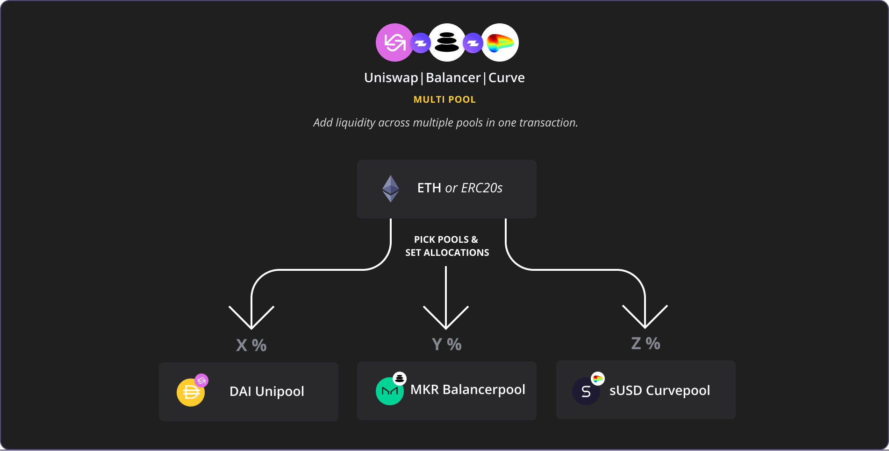
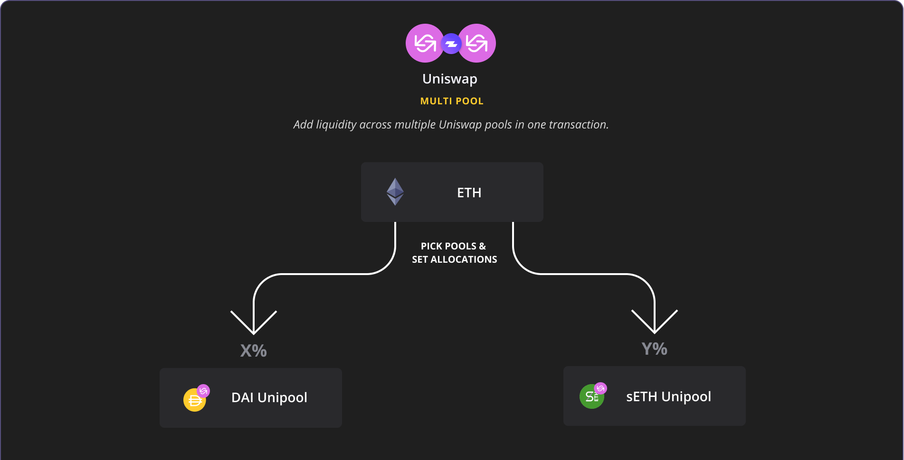
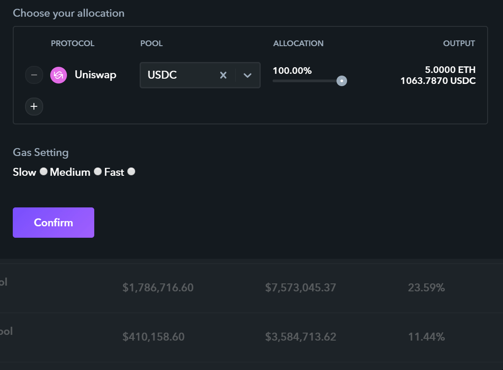

# 🎛️Multipooling

## What does "Multiooling" mean?

> **Diversifying liquidity provisioning across multiple liquidity pools.**

## How does it work?

**1. Visit '**[**Invest**](https://www.zapper.fi/#/invest)**' tab and pick one of the pools you would like to start with. \(NOTE: Curve + Balancer pooling options are being tested.\)**

**2. Click '+' to add on more pools and select your allocation %s by moving the slider.**

**3. Click 'Confirm' and depending on your wallet provider, you will need to verify transaction details before sending. Once you submit your transaction, you will be able to follow progress on Etherscan. Here's a live Multipooling test transaction adding liquidity across sETH, DAI, MKR, REP, LINK, and KNC pools.**

\*\*\*\*

