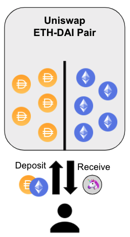
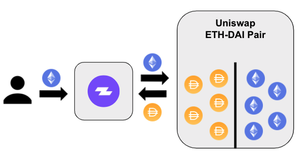
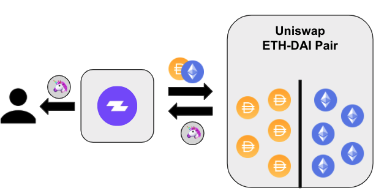
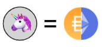

# Pool



## What does "Pooling" mean

> **Providing liquidity to** [_**constant function market makers**_](https://medium.com/bollinger-investment-group/constant-function-market-makers-defis-zero-to-one-innovation-968f77022159) _**& earning proportional exchange fees in return.**_ 
>
> ### Traditional Finance: 
>
> * Most exchanges _**maintain an order book**_ and facilitate matches between buyers and sellers. 
> * For each successful match, traders are charged _**exchange fees**_ which go directly to exchange operators. 
>
> ### The DeFi Difference:
>
> * _**Smart contracts hold liquidity**_ reserves of various tokens, and trades are executed directly against these reserves. 
> * _**Prices are set automatically**_ using the constant product market maker mechanism, which keeps overall reserves in relative equilibrium. 
> * Reserves are pooled between a network of liquidity providers who supply the system with tokens and receive a _**proportional share of transaction fees**_ accrued. 
> * **IMPORTANT NOTE:** With fluctuating prices, liquidity providers may incur [**“impermanent loss”**](https://medium.com/@pintail/understanding-uniswap-returns-cc593f3499ef)**.**

## Adding Liquidity

In the example below a user is supplying ETH and DAI to a Uniswap pool. After adding their assets, they receive Uniswap liquidity provider tokens which represent a share of the underlying assets in the smart contract. When supplying liquidity to Uniswap, the assets need to be provided in 50/50 proportions. For example, if adding $1000 in liquidity to the ETH-DAI pool, $500 worth of DAI and $500 worth of ETH must be added.

## Zapper allows for access to the best pooling opportunities with a single click

Zapper allows for any user to add liquidity in a single transaction. For example, if a user only has ETH, but would like to to supply to the ETH-DAI Uniswap pair with Zapper they don't have to worry about manually converting half the ETH into DAI and then submit another transaction to add the liquidity. 

Instead the Zapper contracts will handle this under the hood and will swap to exactly half the amount of ETH into DAI and will then add both assets to the Uniswap pool. Lastly, the contract will pass the liquidity provider tokens back to the user's address at the end of the transaction, both steps done in one transactions.

## Impermanent Loss TLDR

Impermanent loss sounds like a scary term, but can be broken down into a simple balance between the amount of fees collected by a pool vs the amount of price shift between the supplied assets. Pairs that earn large amounts of fees tend to be the ones that have the most price divergence between the underlying assets. 

In simple terms, when supplying liquidity it is easiest to think that when entering a pool that the liquidity provider tokens are a weighted index of the pool you are in. So when a user zaps in their ETH into the ETH-DAI Uniswap pool they now hold an LP token that is somewhat like a 50/50 weighted index between ETH and DAI. This pool tends to earn lots of fees due to people frequently trading between the assets. However, as a liquidity provider, the user no longer has full price exposure to ETH.

## Explore Different Pooling Opportunities







