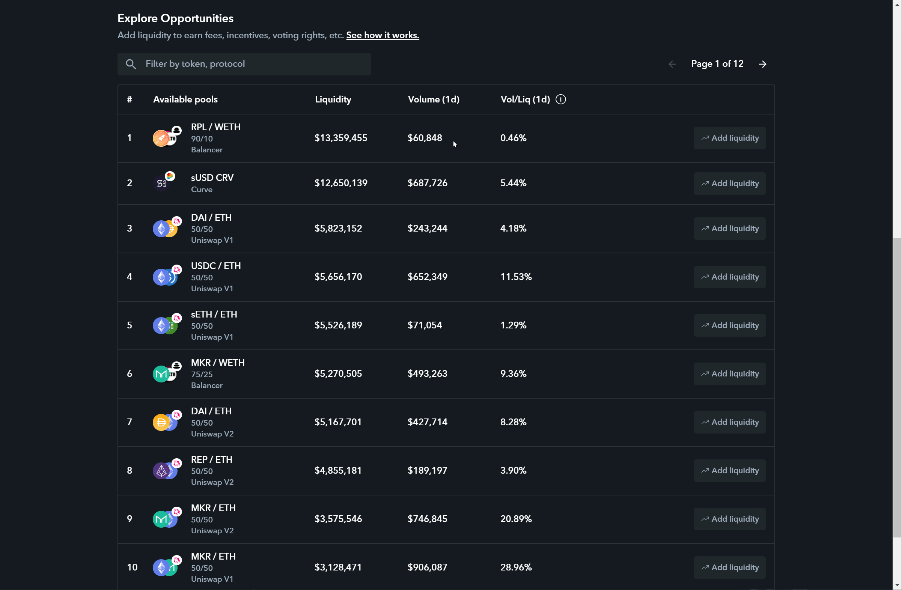
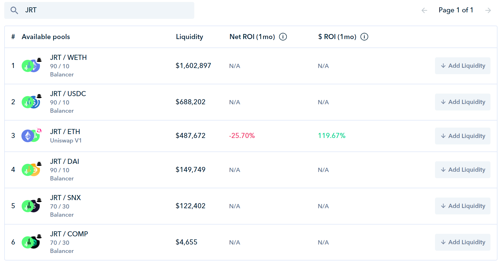

# Balancer




### A constant mean market maker is a generalization of a constant product market maker, allowing for more than two assets and weights outside of 50/50.


 _where **R** is the **reserves** of each asset, **W** is the **weights** of each asset, and **k** is the **constant**. In other words, in the absence of fees, constant mean markets ensure that the **weighted geometric mean** of the reserves remains constant._

| **Balancer Protocol** | system of smart contracts for automated token exchange on Ethereum. |
| :--- | :--- |
| **Balancer Exchange** | opensource front-end interface for traders and liquidity providers to easily interact with Balancer smart contracts. |
| **Balancer Pool** | Exchange contract containing ERC20 pairs. |
| **Liquidity Providers**  | can be anyone who is able to supply equal values of WETH or any ERC-20 token included in a Balancer exchange contract. |
| **BPool** | ERC20 tokens which are minted by LPs from the exchange contract and can be used to withdraw their proportion of the liquidity at any time. |
| **Traders** | exchange one asset for another asset. |
| **Arbitrageurs** | maintain the price of assets within that portfolio in accordance with the market price in exchange for a profit. |







1. **Connect with your wallet.**
2. **Choose which Balancer pool you would like to join.**
3. **Enter how much liquidity you would like to add.**
4. **Confirm the transaction & you will receive Balancer Pool Tokens which are ERC20 tokens that track your liquidity provided to the protocol.**


Note: slippage will increase with larger deposits because your input is being proportionally exchanged to obtain underlying assets required to join the pool with. In order to prevent unnecessary losses due to this price impact, _**currently the slippage limit is set to 5%. This means that if your exchange transaction experiences greater than 5% difference between the market and estimated price due to trade size, the transaction will revert.**_




## Add liquidity to [any Balancer pool](https://www.zapper.fi/invest) to receive $BAL rewards.

On Monday, June 1st at 00:00 UTC \(i.e. at midnight from Sunday to Monday\), Balancer Labs will start considering liquidity held on Balancer protocol for the distribution of governance tokens. 

_**How to get involved.**_ ****Simply [**add liquidity to ANY liquidity pool on Balancer**](https://www.zapper.fi/invest) and you will automatically start accruing BAL tokens to your wallet. Not all pools receive equal BAL rewards, [**you can see how these are allocated here**.](http://www.predictions.exchange/uniswap_markets/)

## Add liquidity to [JRT based Balancer pools](https://www.zapper.fi/invest) to receive $BAL + $JRT rewards.

## **\[DISCONTINUED\] Earn BAL + SNX tokens on top of pool returns by providing liquidity to the SNX/USDC pool.**





