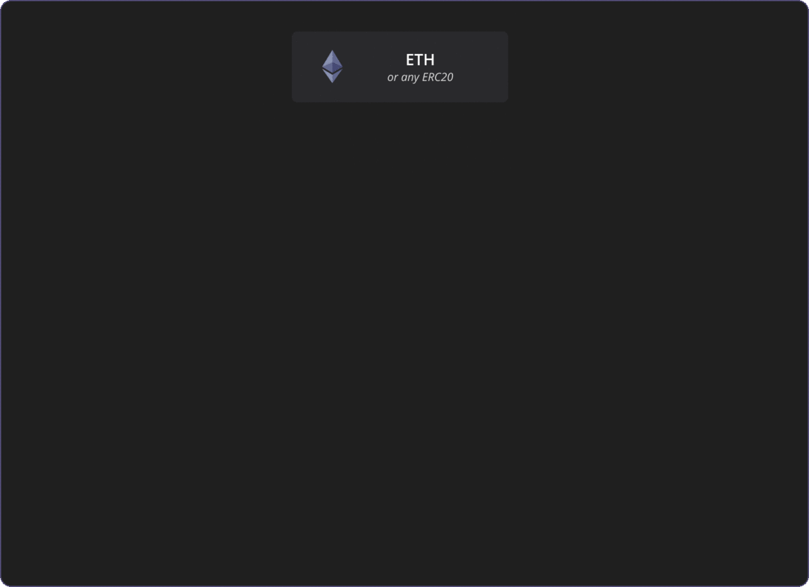
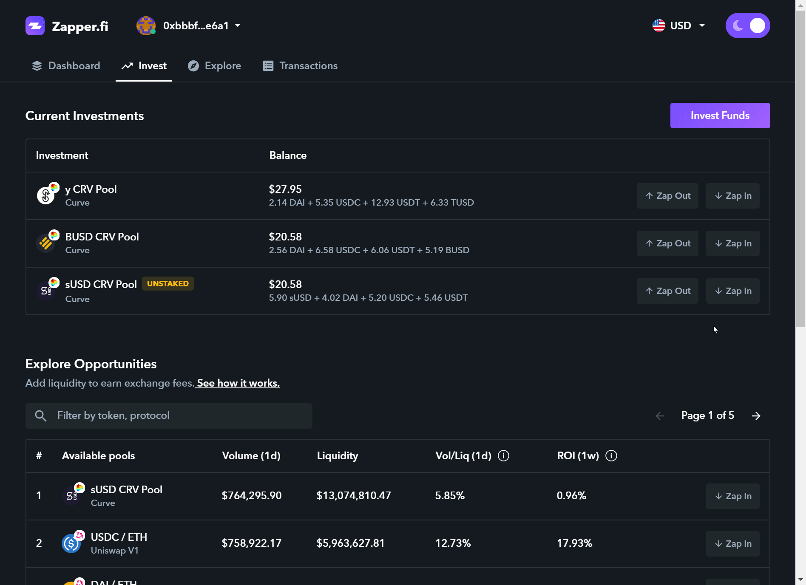

# Curve




### Uses a hybrid of a constant sum and constant product, and arrives at quite a complex function below:


Where **x** is the reserves for each asset, **n** is the number of assets, **D** is an _invariant_ that represents the value in the reserve, and **A** is the “amplification coefficient”, which is a _tunable constant_ that provides an effect similar to leverage and influences the range of asset prices that will be profitable for liquidity providers \(i.e. the higher the asset volatility, the higher **A** should be\).

This function acts as a **constant sum** when the portfolio is balanced and shifts towards a **constant product** as the portfolio becomes more imbalanced. In effect, the function looks like a “zoomed-in hyperbola”.





Risk-averse: prefer stable and predictable income.



Generally bearish on crypto markets for the time being.




SNX incentives available for sUSD Curve Pool.






1. _**Connect**_ your digital wallet.

   _No wallet?_ [_**Get one.**_](https://metamask.io/)_\*\*\*\*_

2. Navigate to the [**Invest**](https://www.zapper.fi/#/invest) tab.
3. Type in _**Curve**_ in the filter & click _**Add liquidity**_ next to the pool you would like to join.
4.  ****Enter how much liquidity you would like to add in _**ETH or ERC20s** \(fiat coming soon\). Token balances show up in the drop-down if you have them available. ****_
5. Confirm the transaction & you will receive Curve Pool Tokens \(CRV\) which are ERC20 tokens that track your liquidity provided to the protocol.


**Note:** Curve pooling options will be included in [**Multipooling** ](../multipooling.md)soon. For now, you are able to submit 2 separate transactions if you would like to add liquidity to both Curve and Uniswap pool.





1. **As usual start by selecting which pool you want to exit.**
2. **For output you are able to select ETH, sUSD, DAI, USDC, TUSD, USDT, or BUSD.**
3. **Confirm your transaction.**



