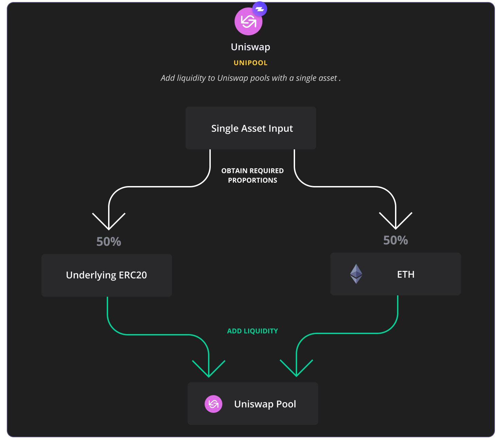
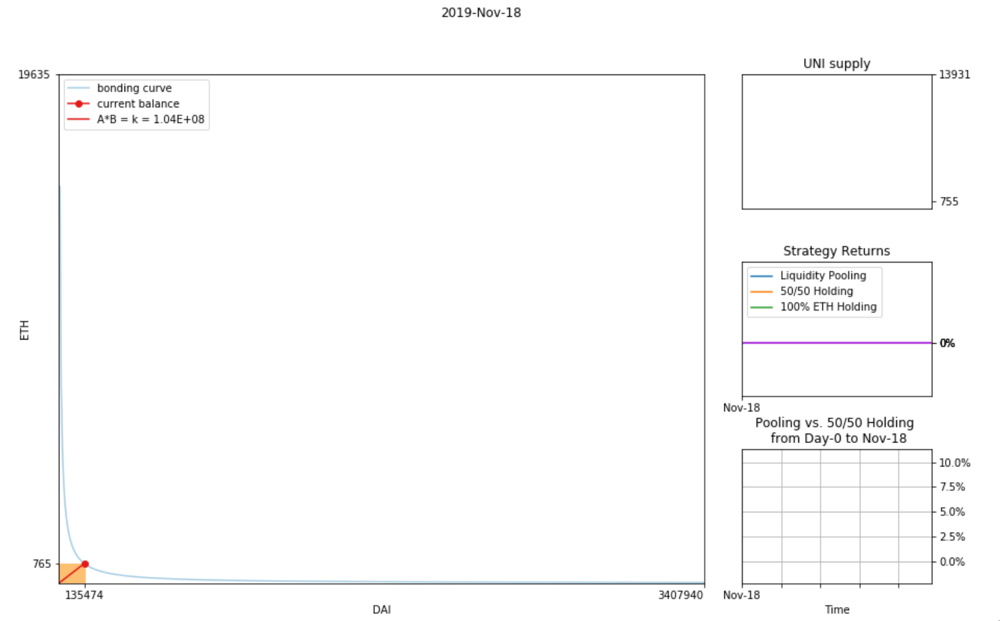

# Uniswap



| **Uniswap Protocol** | system of smart contracts for automated token exchange on Ethereum. |
| :--- | :--- |
| **Uniswap Exchange** | opensource front-end interface for traders and liquidity providers to easily interact with Uniswap’s smart contracts. |
| **Pool** | ETH-ERC20 exchange contract. |
| **Liquidity Providers**  | can be anyone who is able to supply equal values of ETH and an ERC-20 token to a Uniswap exchange contract. |
| **UNI-V1** | ERC20 tokens which are minted by LPs from Uniswap V1 exchange contract and can be used to withdraw their proportion of the liquidity at any time. |
| **Traders** | exchange one asset for another asset. |
| **Arbitrageurs** | maintain the price of assets within that portfolio in accordance with the market price in exchange for a profit. |
| **Exchange fee** | 0.30% is added on to each trade and is proportionally split between UNI-V1 token holders AKA Liquidity Providers. |
| **Market Function** | Constant Product _**x∗y=k**_ |



### **A. Adding liquidity with 2 assets.**

* **In order to mint pool tokens, you are required to deposit an equivalent value of ETH and ERC20 tokens.**
* **So providing liquidity on an ETH/DAI pair could require you to trade half your ETH exposure for DAI in order to participate.**
* **Is it worth exiting 50% of an ETH position to enter a DAI pool? The bet here is that pool growth from trading fees will outweigh your reduced exposure to ETH.** 

### **B. Adding liquidity with 1 asset AKA 'Unipooling'.**

* **Zapper enables liquidity provisioning with** _**a single asset**_**.**
* **Ideal for those who don't have required underlying ERC20 tokens.**
* **Save 3 or more on-chain transactions to mint Uniswap pool tokens.**




> ### Uniswap liquidity provisioning on active pools is proving to be a great alternative to hedge your assets as exchange fees generated seem to be outpacing any impermanent losses incurred. Past few weeks we’ve witnessed some of the most volatile times in crypto history. Extreme volatility resulted in increased volume, especially around stable tokens such as DAI and USDC as many rushed to exit their crypto positions. For example, on March 13th alone, DAI&lt;&gt;ETH LPs proportionally earned ~$75,000 for processing ~$25M worth of swaps!


 _Before entering a Uniswap Pool make sure you understand the concept of impermanent loss which_ [_was covered here_](https://bankless.substack.com/p/how-to-make-money-on-uniswap) _or_ [_here_](https://medium.com/@pintail/uniswap-a-good-deal-for-liquidity-providers-104c0b6816f2) _so you’ve have clear expectations on gain and loss potential._


#### **Choosing a pool**

Broadly speaking, there are three types of pools to consider:

**Pegged Pools**

* Low risk/ low reward
* e.g. [ETH-sETH](https://www.pools.fyi/#/returns/0xe9cf7887b93150d4f2da7dfc6d502b216438f244)
* These pools are for tokens pegged to ETH, meaning you maintain full exposure to ETH while collecting trading fees. There is risk in a peg collapse and historically these pools do not generate a great deal in fees.

**Stablecoin pools**

* High risk/ high reward
* e.g. [ETH-SAI](https://www.pools.fyi/#/returns/0x09cabec1ead1c0ba254b09efb3ee13841712be14)
* These pools are historically popular with traders and often generate a good deal in fees. There is risk of missing out on ETH returns should its price break significantly upwards.

**Standard token pools**

* For existing token holders
* e.g. [ETH-MKR](https://www.pools.fyi/#/returns/0x2c4bd064b998838076fa341a83d007fc2fa50957)
* If you’re already exposed to tokens and rebalancing, there is little harm in supplying liquidity to established pools.

If you’re just starting out as a liquidity provider, try sticking with established pools that have deep liquidity, high trading volume and lots of other liquidity providers.

Avoid low liquidity pools. There is no reasonable expectation of profit starting a new pool or contributing to low liquidity pools as an individual.

Also use caution interacting with pools whose tokens are highly specialized. For example, deflationary token supply mechanisms may severely impact returns.




**You make the highest returns when there’s high trading volume and low price change between the pair. Or when price is volatile but goes back to the ratio you started with.**



**You make the least returns when there’s low trading volume and high price change.**


| DAI Pool Analysis Example | Block _**\[Time\]**_ |
| :--- | :--- |
| `Start` | \*\*\*\*[**\#8,957,433** _****_](https://etherscan.io/tx/0x32d2b60e4b627d5b4d5e9c7369590b53f4512c8c0fccc4401b03c38df4ff4424)_\[Nov-18-2019 04:15:18 PM +UTC\]_ |
| `End` | _\*\*\*\*_[_**\#9,692,210**_](https://etherscan.io/block/9692210) _****\[_Mar-17-2020 11:58:52 PM +UTC_\]_ |

#### 📊 ****ROI SUMMARY SINCE POOL INCEPTION - MAR 17:


HOLDING 100% ETH:🔻**35.97%**



HOLDING 50/50 ETH/DAI:🔻**17.98%**



 DAI LP:🔻**10.07%** 🔥 


### NOTE: These are total pool returns, not individual liquidity providers. Returns for individual LPs will vary highly depending on their proportional share throughout the pooling period. 

### Why? Because if you have 1/10 of all liquidity in the pool, you will generate 10% of all trading fees \(.30 % paid by traders\) but let's say someone adds double the liquidity -&gt; now proportionally you have 1/20. Given the same volume, you will generate less fees since you will only be receiving 5% of all trading fees.


**LP Net Gains =** 

**ETH + ERC20 proportions @withdrawal**

_**minus**_

**ETH + ERC20 proportions @entry**

\*This result would be the difference between the trading fees and the impermanent loss when you withdraw.


**Additional Resources:**

* This report is based on a cadCAD model of Uniswap by [Markus Buhatem Koch](https://community.cadcad.org/t/modeling-uniswap-in-cadcad/35)
* [DAI&lt;&gt;ETH exchange info](https://uniswap.info/token/0x6b175474e89094c44da98b954eedeac495271d0f)



