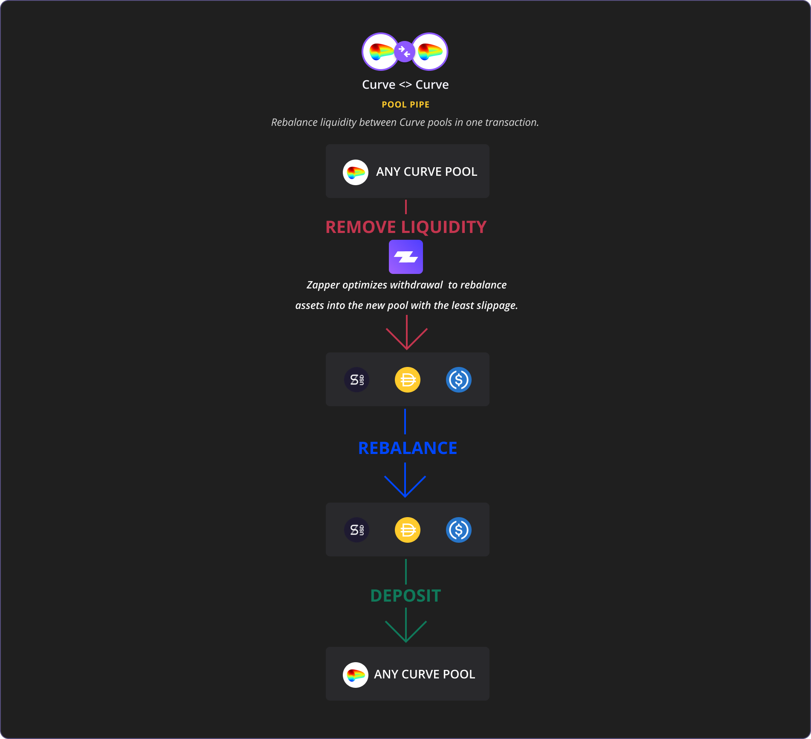

# 🚰Piping

Pool pipes seamlessly **re-balance** liquidity between pools.

### **How does it work?**

Let’s assume you’re providing liquidity in the sETH pool on Uniswap earning trading fees + SNX rewards. 

You noticed that Synthetix just started distributing SNX rewards to Curve sUSD liquidity providers as well.

To move some of your liquidity from Uniswap sETH Pool into Curve’s sUSD Pool, you would need to perform at least 4 on chain transactions:

1. **Remove liquidity from sETH pool on Uniswap**
2. **Use ETH portion to buy DAI** 
3. **Use sETH to buy USDC**
4. **Add DAI + USDC on Curve**

**Uniswap V1 &lt;&gt; Curve Pipe cuts this down to one!**

### **Walk-through tutorial:**

> **STEP 1: Visit Zapper.fi & connect your wallet.**

> **STEP 2: View your liquidity pool balances & click ‘Rebalance’**

> **STEP 3: Choose which platform and which pool within that platform you would like to move some or all of your current pool’s liquidity into.**

> **STEP 4: Click confirm once ready to initiate the transaction.**
>
> **Note: if this is your very first time interacting with pool pipes you will need to confirm an approval transaction at first so you will see 2 requests to confirm. Here’s a sample sETH-&gt;sUSD pool piping transaction: https://etherscan.io/tx/0xf3029af4efae7a82aff195f1f4a3961f0b2fb5c24af8806cb0bc31a80a54abbc**

### **Available Pool Pipes:**

> **While some of these may seem similar, each pipe contains optimizations to help you re-balance your assets with the least slippage.**

### **When to ‘pipe’ aka rebalance?**

Rebalance trigger parameters will differ based on your investment goals and risk profile but in general could be based one of these:

* **Shifts in liquidity provisioning incentives.**
  * We saw this example with SNX shifting some incentives from sETH pool on Uniswap to sUSD pool on Curve.
* **Shifts in trading activity within liquidity pools.**
  * As other pools start catching traction, liquidity providers could capture extra yield moving some assets to those pools.
  * _**Example**_: let’s say you are currently providing liquidity in the DAI/ETH pool on Uniswap V1 which currently averages ~$750K in daily exchange volume with ~$5.5M total liquidity supplied. As you might already know, fees generated from exchanges are proportionally split between all the liquidity providers of that pool. So what you are really looking for are pools with the highest volume/liquidity ratio to generate the most fees per $ supplied. Doing a quick sort by Vol/Liq on Zapper’s Explore Opportunities table, we can see how USDC/ETH pool is a great alternative as the volume is higher while total liquidity supplied is roughly the same. Also, this pool pair retains your previous pool’s asset exposures \(ETH+STABLECOIN\). Keep in mind, some trading activity spikes might be temporary so it’s important to analyze longer time frames to get better average estimates.
* **General market shifts.**
  * As prices of underlying assets change, liquidity providers could diversify by reallocating liquidity between pegged and stable pools.
  * _**Example:**_ let’s say you are currently providing liquidity in the WETH/ETH pool on Uniswap \(aka ETH pegged pool\) and ETH price just doubled in the last 24 hours. You might anticipate some pull-back so you want to sell some of your ETH. But instead of simply selling, you could rebalance some of your liquidity straight into the highest yield generating stable pool on Curve. Now while you are waiting to ‘buy the dip’, your stablecoins are generating fees. To buy back in simply rebalance back into the WETH/ETH pool.
* **Pool yield optimizations.**
  * As any yield hacker knows, opportunities in DeFi need to be capitalized ASAP. With pool piping, it’s never been easier to move liquidity around the DeFi ecosystem. Each pool pipe is a general smart contracts so once a pipe is deployed between two underlying platforms, anyone is able to instantly move liquidity between ANY pools within those platforms. Builders could deploy their own auto-rebalancing logic which uses pool pipes to shift liquidity based on set logic.

