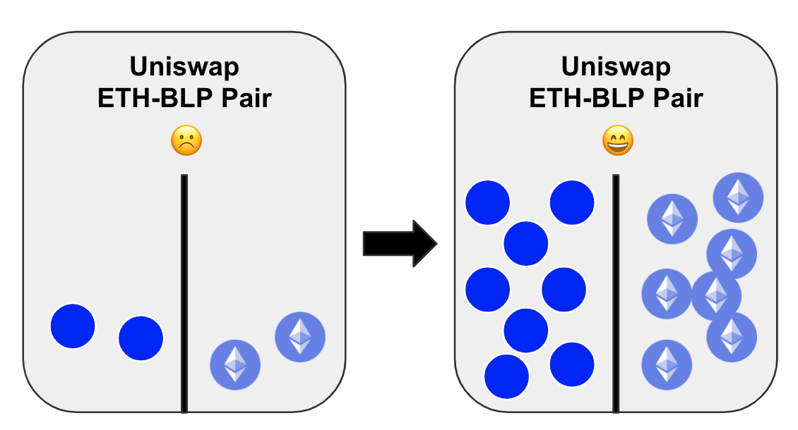
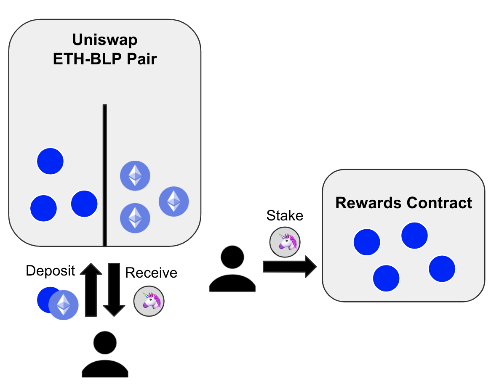
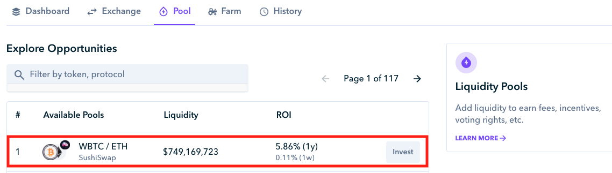
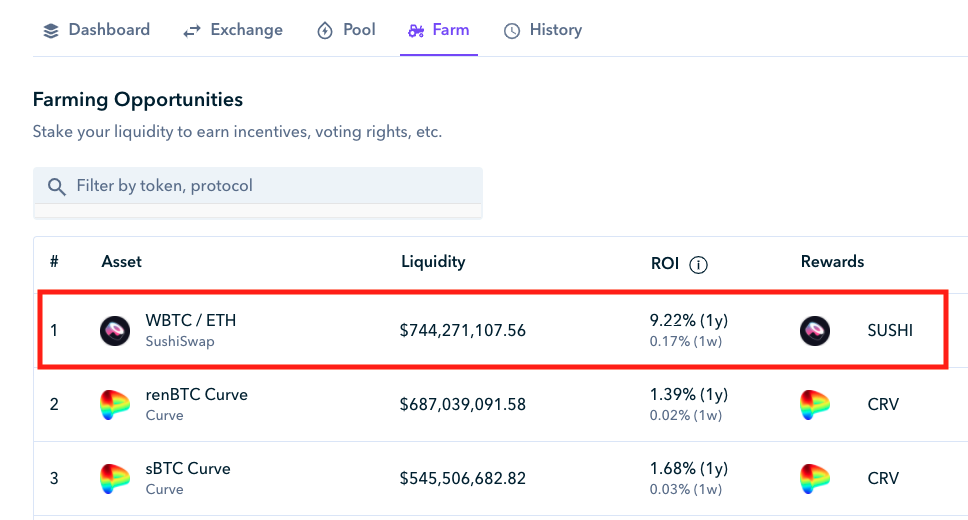

# Farm

## **What does 'Yield Farming' mean?**

**Utilizing your assets to generate governance tokens.**



## How does Farming work?

Let's say that there is a new token called Bleep Token \(BLP\) and they are hoping to gain liquidity on different decentralized exchanges. Ideally, as a new token it is important to have liquid markets because it allows for larger trades without slippage. 

In this example, a way for the Bleep Token \(BLP\) creators to get liquidity on Uniswap could be incentivize it through a rewards program where anyone that locks up ETH/BLP Uniswap Liquidity provider tokens in a rewards contract will reward Bleep Token \(BLP\) over time until they remove their liquidity provider tokens.

## Farming on Zapper 

You can add assets to different liquidity pools under the pool tab. The example below shows how you can invest into the WBTC/ETH pool on Sushiswap. 

Once you has invested into a pool, you can then take your liquidity provider tokens and lock them into a rewards contract. In this example, the SUSHI liquidity provider tokens can be locked into the reward contracts to earn SUSHI as a reward for providing liquidity to Sushiswap. 

