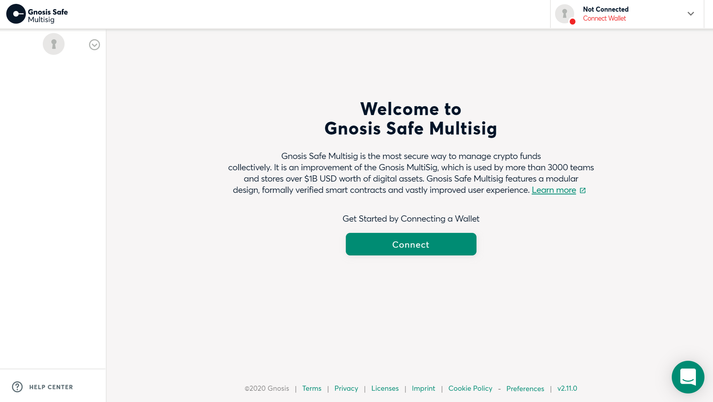
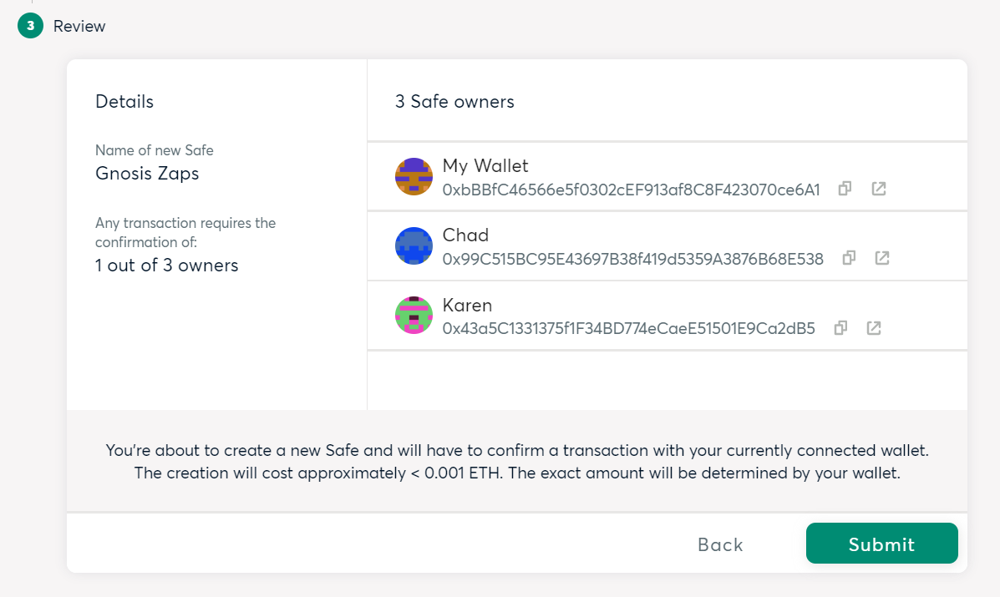
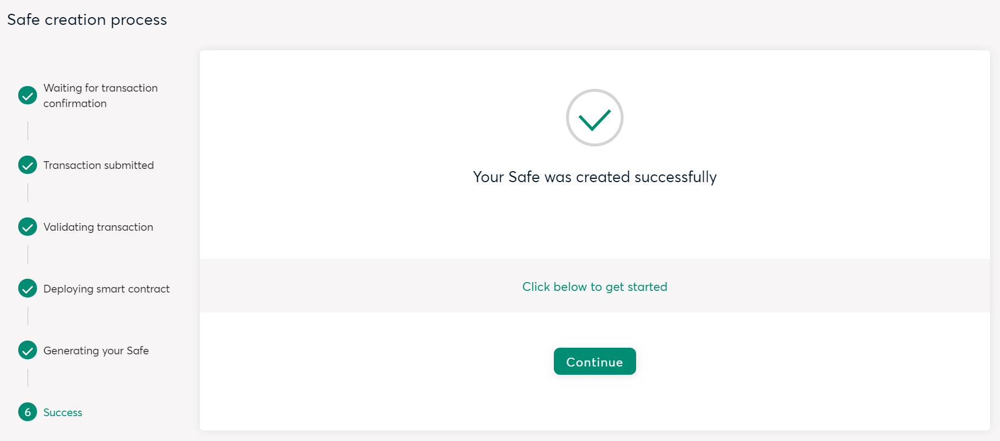

# 🔏How to create a new Gnosis Safe Multisig

## 🔗Visit [https://gnosis-safe.io/app](https://gnosis-safe.io/app/#/welcome)

## 👉Click _Connect_ to sign in with your wallet.

## 👉Click _Create new Safe_

## 🔤Name your Safe.

## 🗝️Name Owners and their Ethereum wallet addresses and set how many owners need to confirm in order to process transactions.

Example: if you have 3 owners and you set this to 2, in order to initiate transactions at least 2 out of 3 wallets will need to confirm from their wallets.

## 👉ClickReview all your info and click _Submit_ 

## 👉This will initiate a transaction which will create and deploy your Gnosis Safe - which is a smart contract in itself. Click _Confirm_ from your wallet. Keep in mind gas fees go to the miners in order to process your transaction on-chain.

## ✅Once your transaction has been processed, you should see "Your Safe was created successfully"

