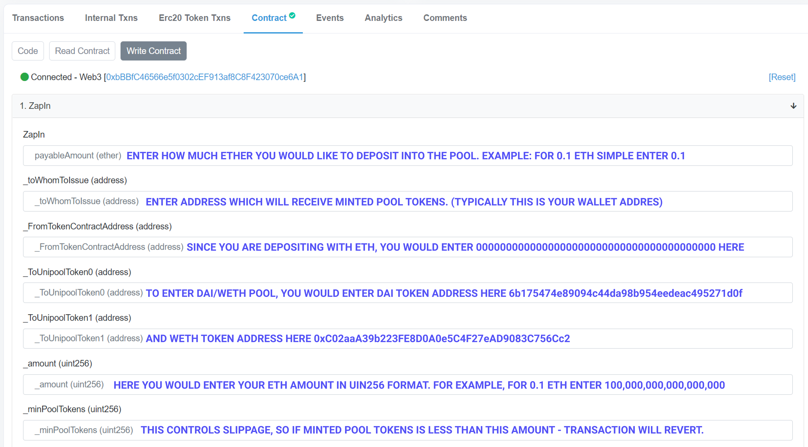
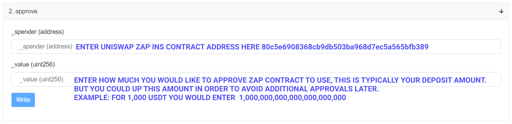

# 🔷 Using Zaps from Etherscan

## Enter any Uniswap pool using just ETH:

### 1. Visit [https://etherscan.io/address/0x80c5e6908368cb9db503ba968d7ec5a565bfb389\#writeContract](https://etherscan.io/address/0x80c5e6908368cb9db503ba968d7ec5a565bfb389#writeContract)

### 2. Click "Connect to Web3" 

### 3. Connect your wallet 

### 4. Fill out _ZapIn_ function parameters

### 5. Once ready, click Write and confirm the transaction from your wallet. If successful you should see something like this:

## Enter any Uniswap pool using any ERC20 token:

### 1. The process for joining pools with ERC20 tokens is very similar to ETH, however you will first need to approve your ERC20s for Zapping. For example, if you are depositing with USDT-visit [https://etherscan.io/address/0xdac17f958d2ee523a2206206994597c13d831ec7\#writeContract](https://etherscan.io/address/0xdac17f958d2ee523a2206206994597c13d831ec7#writeContract) Connect your wallet and fill out _approve_ function parameters

### 2. Now go back to [https://etherscan.io/address/0x80c5e6908368cb9db503ba968d7ec5a565bfb389\#writeContract](https://etherscan.io/address/0x80c5e6908368cb9db503ba968d7ec5a565bfb389#writeContract) and fill out ZapIn function parameters, this time your _\_FromTokenContractAddress_  will be the USDT token contract address. If successful you should see something like this:

