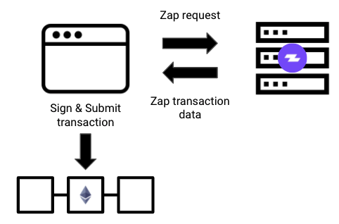

# Getting Started

The Zapper API provides some of the most robust DeFi related data, everything from liquidity and prices on different AMMs to complex DeFi protocol balances all in one convenient place. In addition, the API also supports bridging between different networks as well as formatted Zap transaction endpoints.


We ask that builders using the API include our **"Powered by Zapper"** logo with a backlink to [https://zapper.fi](https://zapper.fi) in their project. **"Powered by Zapper"**  brand asset can be downloaded [here](../additional-resources/brand-assets.md).


### Data Endpoints

The Zapper Developer APIs provides the Ethereum community with accessible and consistent DeFi data for an ever increasing number of protocols. For a full list of supported protocols, see [**here**](https://zapper.fi/protocols). Check out the [guides](api-guides/#data-api) section to see how to query account balances, pool stats, and more.

### Transactions Endpoints

The Zapper API Transaction endpoints makes it easy for builders to interact directly with a wide range of DeFi protocols. Get an easy to consume transaction for approving, adding, removing, and rebalancing liquidity through any of our [zaps](../zapper-smart-contracts/smart-contracts.md). Making it a breeze to submit a DeFi related transaction.

This API returns a transaction object which includes all of the contextual data needed to be consumed by [Web3](https://web3js.readthedocs.io/en/v1.2.0/web3-eth.html#sendtransaction), Ethers or other Smart Contracts. This enables anyone to assemble and execute a complex Zap including multi exchange hops and interacting with several DeFi protocols in a single atomic transaction. To learn more, check out the [guides](api-guides/) section.

## API Support


For any API related inquiries, please reach out in the **`build-on-zapper`** channel in our [Discord](https://discord.com/invite/5C4wxPr).


