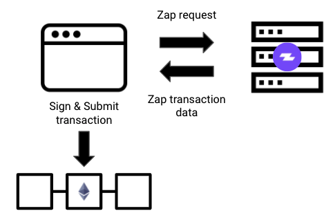

# API Guides

## Transaction Endpoints

Assembling a Zap transaction is simple to do with the Transaction endpoints. Provide basic details like the token to sell, pool or vault to interact with, and token quantities to send and the API will assemble and return an easy to consume Zap transaction for you to use in apps or smart contracts. 

The same patterns shown in these guides can be applied to all of the [zaps](../../zapper-smart-contracts/smart-contracts.md) offered by Zapper

* The [Yearn Zap In guide](zap-in.md) demonstrates how to create an easy to consume transaction object for interacting with Zaps with web3 or in your smart contracts directly.
* The [Sushiswap Zap Out guide](zap-out.md) goes over how to create and consume a transaction object to enable one click Zap Outs from Sushiswap into ETH or any arbitrary token

## Data Endpoints

### Pool/Vault Stats and Account Balances

The same patterns shown here can be used for any of Zapper's [supported platforms](https://zapper.fi/protocols).

* The Yearn [Vault Stats guide](vault-stats.md) shows you how to pull data from the Zapper Data Endpoints. Vault stats includes platforms whose deposits are used for automated farming strategies \(e.g. Yearn, Harvest, Pickle, etc.\)
* The [Sushiswap Pool Stats guide ](pool-stats.md)shows you how to get pool data from the Zapper Data API. Pool stats includes platforms whose deposits are pooled as liquidity for exchanges \(e.g. Sushiswap, Uniswap, Balancer, etc.\)
* Fetching user balances for Zapper's supported platforms is also possible. Check out the [Protocol Balances guide](curve-balances.md) for examples.

### Tokens, Gas Prices, Misc

* The [Token Balances API](token-balances.md) returns a list of tokens for which the account has a balance.
* The [Prices API](supported-tokens-and-prices.md) returns an easy to consume list of Zapper's supported tokens and their USD prices.
* The [Gas Price API](gas-price.md) returns Zapper's current gas prices.

## API Support 


For any API related inquiries, please reach out in the **`build-on-zapper`** channel in our [Discord](https://discord.com/invite/5C4wxPr).


