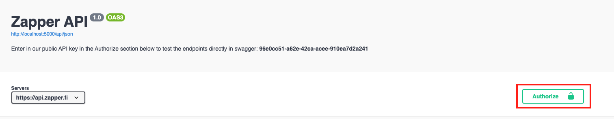

# Endpoints

## Public API Key

The Zapper API uses [API Keys](https://swagger.io/docs/specification/authentication/api-keys/) to authenticate requests. Zapper has made available for public use the following API key **`api_key=96e0cc51-a62e-42ca-acee-910ea7d2a241`**


We ask that builders using the API include our **"Powered by Zapper"** logo with a backlink to [https://zapper.fi](https://zapper.fi) in their project. **"Powered by Zapper"**  brand asset can be downloaded [here](../additional-resources/brand-assets.md).


## Zapper Endpoints

The Swagger UI ****linked below contains an overview of all of the available endpoints. Be creative and feel free to reach out to us with suggestions or to show us what you've built. 



#### Endpoint Overview



#### Using the Public API key in Swagger

If you enter in the **public API key into the Authorize section in Swagger** you will be able to directly test the endpoints in the Swagger UI. 


For any API related inquiries, please reach out in the **`build-on-zapper`** channel in our [Discord](https://discord.com/invite/5C4wxPr).


